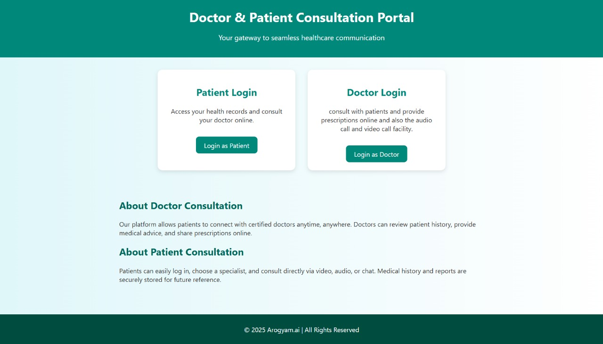
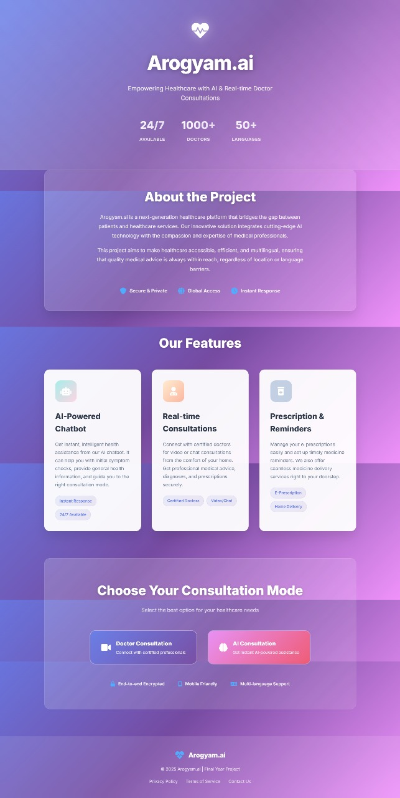
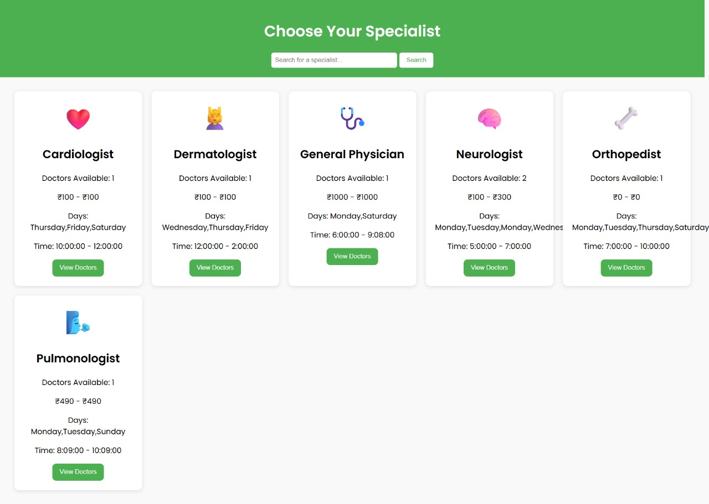
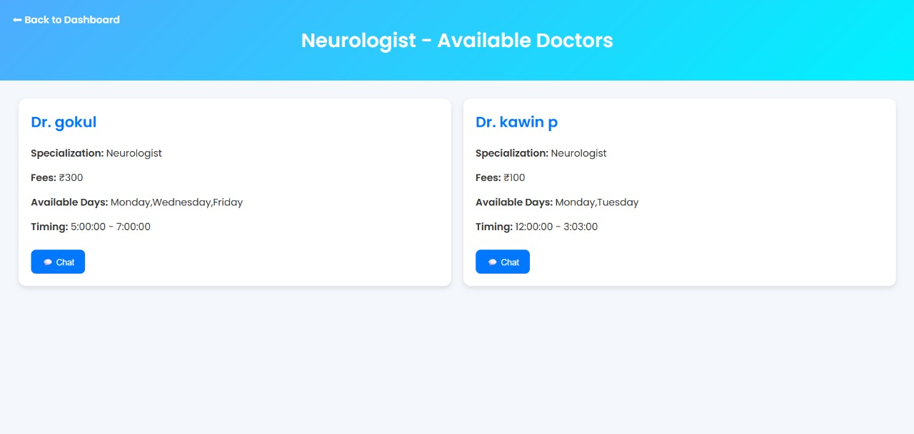
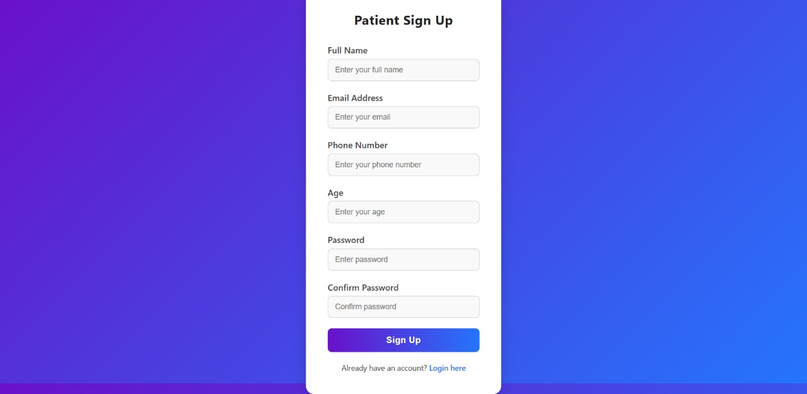

# 🏥 Arogyam.ai

## 📌 Project Overview

Arogyam is designed to simplify how patients connect with medical professionals. The platform allows patients to:

- Browse doctors by specialization
- View availability, consultation fees, and schedules
- Register and log in as a patient
- Select a doctor and securely pay consultation fees via UPI
- Initiate chat, voice, or video consultations
- Provide feedback and rate doctors

Doctors can:

- Sign up using their license number
- Set their specialization, consultation schedule, and fees
- Log in to manage their dashboard and availability

---

## 🚀 Features

🧑‍⚕️ Doctor Management

- Doctor registration with license verification
- Schedule and fees configuration
- Doctor dashboard

👩‍⚕️ Patient Module

- Patient registration/login
- Search specialists
- Filter doctors by fees, days, time

💬 Consultation Options

- Chat with doctor (text)
- Voice call / Video call buttons
- Feedback and review submission

---

---
## ScreenShots
- 

---


- 

---


- 

---


- 

---

- 

---


- 

---

---

## 🧰 Tech Stack

| Layer       | Technology                    |
|-------------|------------------------------|
| Backend     | Python (Flask)               |
| Frontend    | HTML5, CSS3 (custom styles)  |
| Database    | MySQL                        |


---

---


## Installation

```bash
git clone https://github.com/Kawinkawin/Arogyam.ai.git

```
# Contact

If you have any questions or feedback, feel free to reach out:

| Name            | Email                    | 
|-----------------|--------------------------|
| Kawin P         | kawin.p2022ai-ds@sece.ac.in  |  
| Gokul N         | gokul.n2022ai-ds@sece.ac.in  | 
| Nishanthan GS   | nishanthan.gs2022ai-ds@sece.ac.in  | 
