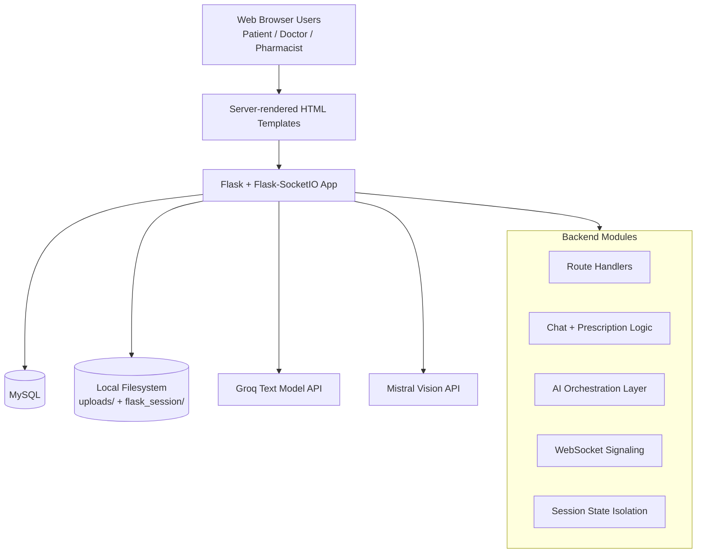
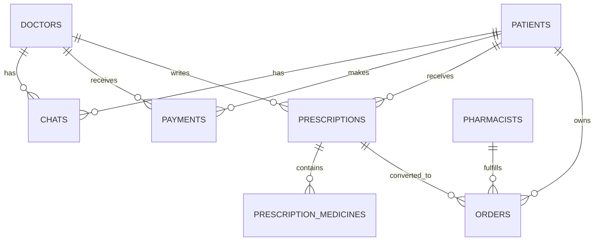

# Arogyam: Complete Project Architecture

Date: 2026-04-11
Project root: Arogyam

## 1. System Purpose
Arogyam is a healthcare platform that combines:
- Human tele-consultation (patient <-> doctor messaging, prescription creation, pharmacist fulfillment)
- AI-assisted medical consultation (specialist chat, image analysis, PDF report analysis)

The platform is monolithic at runtime (single Flask app process), with feature modules implemented inside one main backend service.

## 2. High-Level Architecture


## 3. Technology Stack
- Language: Python 3.x
- Web framework: Flask
- Realtime: Flask-SocketIO (threading async mode)
- Database: MySQL (mysql-connector-python)
- Session backend: Flask-Session (filesystem)
- AI text model access: groq package
- AI vision model access: HTTP call to Mistral chat completions endpoint
- PDF processing: pypdf
- Embedding/RAG deps present: sentence-transformers, chromadb (current RAG implementation is lightweight in-memory)
- Frontend: Jinja templates + CSS + inline JavaScript

## 4. Repository Structure (Functional View)
- backend/app.py
  - Main Flask app, route handlers, SocketIO events, app wiring
- backend/models.py
  - AI clients and prompt logic:
    - GroqChatClient
    - VisionModelClient
    - MedicalRAGPipeline
- backend/create_tables.py
  - Database schema creation script
- backend/reset_pharmacists.py
  - Utility script to reset pharmacists table data
- backend/templates/
  - Patient, doctor, pharmacist, AI specialist pages
- backend/static/css/
  - Stylesheets
- backend/static/js/
  - Currently empty (logic is mostly inline in templates)
- uploads/
  - Uploaded files used for AI analysis
- flask_session/
  - Server-side session files

## 5. Backend Runtime Components

### 5.1 Flask App Layer
Responsibilities:
- HTTP routing for all user portals and APIs
- Session initialization and persistence
- DB connection usage per request flow
- AI orchestration calls
- File upload handling

### 5.2 SocketIO Layer
Responsibilities:
- WebRTC signaling relay between doctor and patient
- Emergency triage event push to dashboards

### 5.3 Data Access Pattern
Pattern used:
- Direct SQL queries in route handlers
- No ORM
- Open connection -> execute query -> close connection per request flow

### 5.4 Session Architecture
Session keys are specialist-scoped for AI flow to avoid cross-specialist contamination:
- conversation_history_by_specialist
- uploaded_files_by_specialist
- session_ids_by_specialist

Legacy shared keys are explicitly removed when specialist-scoped state is initialized.

## 6. AI Subsystem Architecture

```mermaid
flowchart LR
    USERMSG[User Message + Optional Files] --> APICHAT[/api/chat]
    APICHAT --> ROUTEDECIDE{Files attached?}

    ROUTEDECIDE -->|No| GROQFLOW[GroqChatClient.chat]
    ROUTEDECIDE -->|Yes| FILEFLOW[process_uploaded_files]

    FILEFLOW --> PDF{PDF?}
    FILEFLOW --> IMG{Image/DICOM?}

    PDF --> RAG[MedicalRAGPipeline.process_pdf + query_documents]
    IMG --> VISION[VisionModelClient.analyze_image_specialist_aware]

    VISION --> MODALITY[Detect modality: CT/MRI/Xray/Ultrasound/Generic]
    MODALITY --> VPROMPT[Build specialist-aware prompt]
    VPROMPT --> MISTRALCALL[Mistral API Call]

    RAG --> COMBINE[Combine file analysis text]
    MISTRALCALL --> COMBINE
    COMBINE --> GROQCTX[Groq chat with image/report context]

    GROQFLOW --> RESPONSE[Structured Clinical Response]
    GROQCTX --> RESPONSE
```

### 6.1 GroqChatClient
Core features:
- Specialist-aware system prompts
- Structured six-section response enforcement
- Follow-up aware conversation context
- Greeting-only guard to avoid hallucinated cases
- Prescription draft generation from chat history
- Prescription safety verification

### 6.2 VisionModelClient
Core features:
- Uses Mistral Pixtral model for image interpretation
- Modality-aware prompts (CT, MRI, X-ray, Ultrasound, Generic)
- Specialist-aware context focus areas and urgency indicators
- Confidence-level framing and safety constraints
- Fallback response when API unavailable

### 6.3 MedicalRAGPipeline
Current implementation behavior:
- Extracts text from PDF with pypdf
- Keeps document text in-memory dictionary per session pipeline
- Retrieves basic term-matched snippets
- Returns concise evidence list

## 7. Database Architecture

## 7.1 Tables
- patients
- doctors
- chats
- payments
- prescriptions
- prescription_medicines
- pharmacists
- orders

## 7.2 Entity Relationship Diagram


## 8. Frontend Architecture

### 8.1 Rendering Pattern
- Server-side rendering with Jinja templates
- Each feature page embeds local JS logic (fetch calls, polling, WebRTC code)
- CSS files under backend/static/css

### 8.2 Main Page Domains
- Landing and AI specialist pages
- Patient registration/login/dashboard pages
- Doctor registration/login/dashboard/chat pages
- Prescription and pharmacy order pages

### 8.3 Frontend Interaction Modes
- REST fetch API for CRUD-style actions
- Polling every 3 seconds for chat updates
- SocketIO for emergency events and WebRTC signaling in relevant pages

## 9. Realtime and Video Signaling Architecture

Signaling event flow:
- join_room
- start_call
- webrtc_offer
- webrtc_answer
- webrtc_ice_candidate

Room key pattern:
- room = doctor_id + "_" + patient_id

Important architectural note:
- Signaling backend is present.
- Full WebRTC wiring exists in doctor-side chat_with_patient page.
- Patient-side chat_doctor page currently has call icons but does not implement full signaling and peer connection flow.

## 10. API Surface (Logical Groups)

### 10.1 Human consultation and portal routes
- Patient/doctor/pharmacist registration and login
- Doctor-patient chat routes
- Payment route for consultation unlock

### 10.2 Prescription and pharmacy routes
- Save prescription
- Draft prescription (AI)
- Verify medication safety (AI)
- View/get prescriptions
- Pharmacist listing and order status management

### 10.3 AI specialist routes
- Specialist chat page render
- AI text chat endpoint
- File upload endpoint
- Clear specialist session endpoint
- Save patient info endpoint

### 10.4 SocketIO events
- Signaling events and connect/disconnect events

A full route/event inventory is provided in:
- docs/PROJECT_ROUTE_EVENT_INVENTORY.md

## 11. Configuration Architecture

Environment variables used:
- FLASK_SECRET_KEY
- DB_HOST
- DB_USER
- DB_PASSWORD
- DB_NAME
- GROQ_API_KEY
- GROQ_MODEL
- MISTRAL_API_KEY

Defaults are present in code for local development.

## 12. Security and Reliability Characteristics

Strengths:
- Specialist-scoped session state for AI context isolation
- Input checks on several forms and API routes
- File type whitelist and max upload size

Risks and limitations:
- Passwords are stored in plain text (patients/doctors)
- SQL access is manual everywhere; no central data access layer
- Inline JS duplication across templates increases drift risk
- Polling-based chat is less efficient than socket message streaming
- Video flow not symmetric across both chat pages

## 13. Architecture Gaps To Address
- Centralize config and app factory pattern
- Add auth hardening and password hashing
- Unify chat UI logic into static JS modules
- Make WebRTC fully symmetric on both doctor and patient pages
- Add service-layer abstraction for DB and AI calls
- Add migrations/versioning for schema evolution

## 14. Summary
The architecture is feature-rich and already supports end-to-end telehealth + AI-assisted consultation in one deployable Flask service. The highest-value improvements are security hardening, frontend signaling parity, and modularization of route/business logic.
