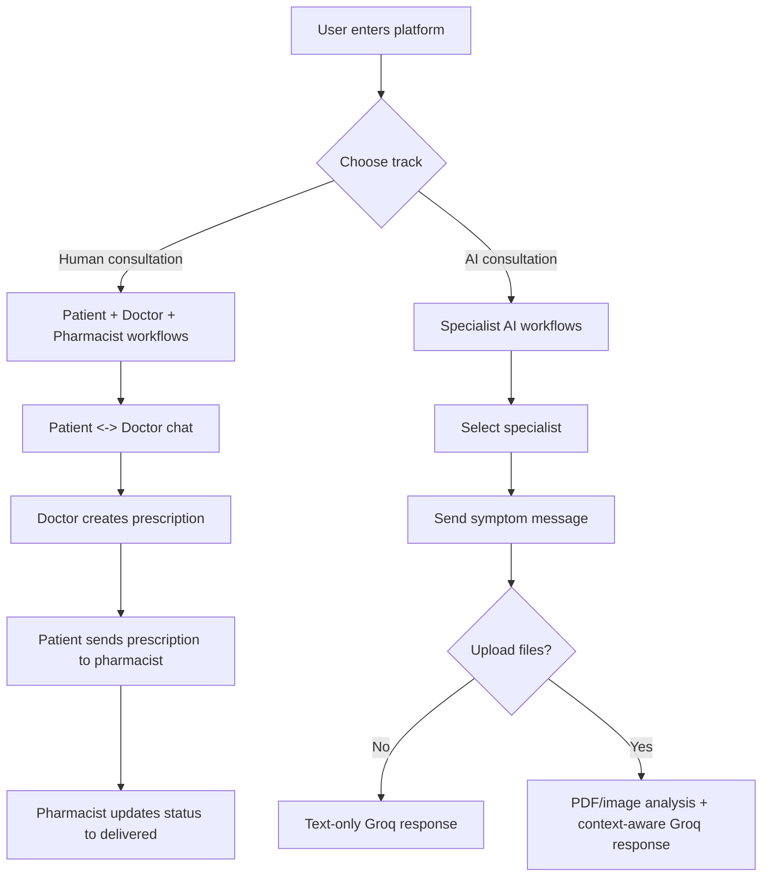
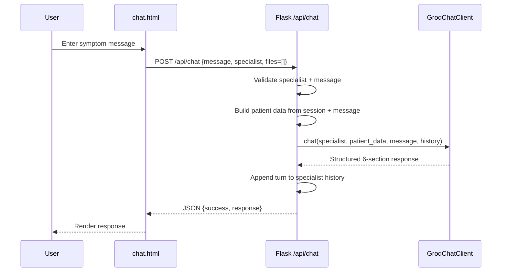

# Arogyam: Complete Project Workflow

Date: 2026-04-11

## 1. Workflow Overview
Arogyam has two major runtime tracks:
- Human care track: patient-doctor consultation, prescriptions, pharmacist order lifecycle
- AI care track: specialist AI chat with optional report/image upload and analysis

## 2. End-to-End User Workflow Map

## 3. Human Consultation Workflows

## 3.1 Patient Registration and Login
1. Patient opens registration page.
2. Submits name, email, password, phone, age.
3. Backend checks duplicate email.
4. On success, patient record is created in patients table.
5. Patient logs in and session stores patient_id.
6. Patient dashboard loads specialist categories from doctors table.

## 3.2 Doctor Registration and Login
1. Doctor opens signup page.
2. Submits identity, specialization, license number, fee, schedule, password.
3. Backend validates uniqueness by license_number.
4. On success, doctor record is inserted into doctors table.
5. Doctor login verifies name + password and stores session doctor metadata.
6. Doctor dashboard loads all patients with chat history for that doctor.

## 3.3 Paid Chat Consultation
1. Patient opens /chat/<doctor_id>/<patient_id>.
2. Backend checks latest payment status from payments table.
3. If unpaid, payment panel is shown.
4. Patient posts to /pay route.
5. Payment entry is inserted with status paid.
6. Chat becomes available.

## 3.4 Message Exchange
1. Sender posts JSON to /send_message with patient_id, doctor_id, sender, message.
2. Backend inserts row into chats table.
3. Both UI pages poll /get_messages/<doctor_id>/<patient_id> every 3 seconds.
4. Messages render in chronological order.

## 3.5 Doctor Prescription Flow
1. Doctor opens /give_prescription/<doctor_id>/<patient_id>.
2. Doctor optionally generates AI draft via /api/draft_prescription/<doctor_id>/<patient_id>.
3. Doctor optionally runs safety check via /api/verify_prescription.
4. Doctor submits final prescription to /save_prescription.
5. Backend inserts into prescriptions and prescription_medicines.

## 3.6 Patient Prescription and Pharmacy Order Flow
1. Patient views prescriptions via /view_prescriptions/<doctor_id>/<patient_id> or /get_prescriptions/<patient_id>.
2. Frontend fetches pharmacists via /api/get_pharmacists.
3. Patient places order via /api/create_order with prescription_id + pharmacist_id.
4. Backend creates orders row with pending status.
5. Pharmacist dashboard displays grouped orders with medicines.
6. Pharmacist updates order status using /api/update_order_status.
7. Patient tracks order progression in /patient_orders/<patient_id>.

## 4. AI Specialist Workflow

## 4.1 Specialist Selection and Session Isolation
1. User opens /specialists and chooses a specialist card.
2. Route /chat/<specialist_type> validates specialist key.
3. Backend initializes specialist-scoped session containers:
   - conversation history
   - uploaded files
   - specialist session id
4. Legacy shared keys are removed to prevent leakage between specialties.

## 4.2 AI Text-Only Consultation

## 4.3 AI File Upload and Analysis Workflow
1. User uploads PDF/image/DICOM from chat sidebar.
2. Frontend posts file to /api/upload with specialist key.
3. Backend validates extension and size, stores file in uploads folder, and records file metadata in specialist session state.
4. User sends message referencing uploaded files.
5. /api/chat invokes process_uploaded_files.

File processing branches:
- PDF:
  - MedicalRAGPipeline.process_pdf extracts text.
  - query_documents retrieves relevant snippets.
- Image/DICOM:
  - VisionModelClient detects modality.
  - Builds specialist-aware modality prompt.
  - Calls Mistral vision API.

6. Combined file analysis is passed as context into Groq text chat.
7. Final response includes both analysis and specialist consultation guidance.

## 4.4 Emergency Triage Workflow
1. /api/chat checks message against emergency keyword list.
2. If matched, backend emits emergency_triage SocketIO event.
3. Doctor dashboard listens and renders urgent alert box.

## 5. Video Call Signaling Workflow

## 5.1 Current Signaling Backend
SocketIO events:
- join_room
- start_call
- webrtc_offer
- webrtc_answer
- webrtc_ice_candidate

Room key:
- doctor_id_patient_id

## 5.2 Current Frontend Behavior
- chat_with_patient page:
  - Has full WebRTC + SocketIO call flow
  - Captures media stream, creates peer connection, exchanges offer/answer/candidates
- chat_doctor page:
  - Shows call action icons only
  - Does not implement full signaling handlers and peer connection flow

Result:
- Signaling architecture exists, but user-facing video call parity is incomplete.

## 6. Data Lifecycle Workflows

## 6.1 Session Data
- Stored server-side with Flask-Session filesystem backend.
- Specialist AI state is isolated by specialist key.
- Clear-session endpoint removes uploaded files, RAG collections, and session keys.

## 6.2 Uploaded Files
1. Uploaded to uploads/ with timestamped filenames.
2. Metadata stored in session state.
3. Used in AI processing calls.
4. Removed when clear session endpoint is called.

## 6.3 Chat and Clinical Records
- chats table stores all doctor-patient messages with sender + timestamp.
- prescriptions and prescription_medicines store clinical output.
- orders table tracks pharmacy execution lifecycle.

## 7. Route Workflow Inventory by Domain

## 7.1 Portal and auth flows
- Home, doctor/patient/pharmacist entry routes
- Signup/login routes per role
- Logout route

## 7.2 Consultation flows
- Patient-doctor chat routes
- Message send and fetch APIs
- Payment route

## 7.3 Prescription and pharmacy flows
- Save prescription
- AI draft and AI safety verification
- View/get prescriptions
- Pharmacy create/update order APIs

## 7.4 AI specialist flows
- Specialist page and specialist chat page
- /api/chat, /api/upload, /api/patient-info, /api/clear-session

## 7.5 Realtime flows
- SocketIO signaling and emergency triage events

Complete endpoint and event list is documented in:
- docs/PROJECT_ROUTE_EVENT_INVENTORY.md

## 8. Failure and Fallback Workflows

## 8.1 AI text fallback
If Groq client is unavailable:
- Structured fallback response is generated with follow-up prompts and safety disclaimer.

## 8.2 AI vision fallback
If Mistral service fails/unavailable:
- Vision client returns service-unavailable guidance and directs professional interpretation.

## 8.3 Upload validation failures
- Invalid extension or missing file returns explicit JSON error.
- Oversized files are rejected by max content length and frontend checks.

## 9. Operational Workflow (Runbook)
1. Configure .env variables.
2. Run create_tables.py to initialize schema.
3. Start backend with app.py.
4. Open /index or root route.
5. Validate major paths:
   - patient-doctor chat
   - prescription create/view
   - pharmacy ordering
   - AI text chat
   - AI image/pdf upload
   - emergency triage alert
   - video signaling behavior

## 10. Current Workflow Gaps and Priority Fixes
1. Complete patient-side WebRTC integration in chat_doctor page.
2. Add missing specialist parity across all UIs (for example gynecologist visibility where absent).
3. Replace polling chat with socket message streaming to reduce latency and load.
4. Harden auth and password storage for production readiness.

## 11. Summary
The project already implements an end-to-end healthcare workflow from consultation to medication fulfillment, plus AI-assisted specialist analysis. The architecture supports all major workflows in one service, with the highest-value completion item being full two-sided video-call implementation and consistency updates across specialist UIs.
